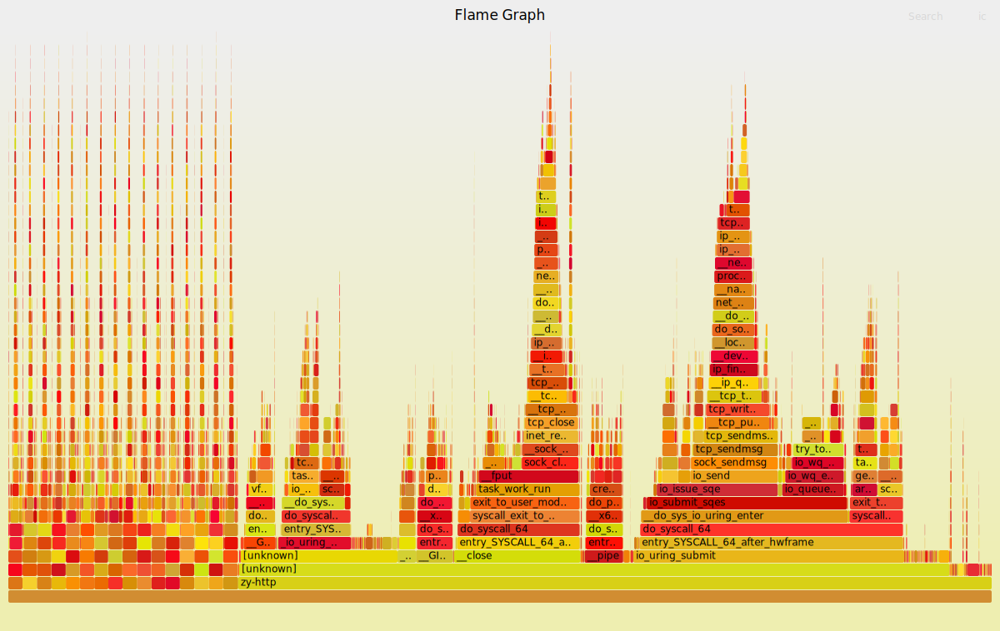

# `zy-http`

## `zy-http`: 基于`io_uring`和`C++ Coroutine`的静态资源HTTP服务器

与传统的基于Reactor+Epoll技术栈的服务器不同，`zy-http`利用了Linux下的最新的异步IO库 — `io_uring`，构建了一个高效的`Proactor`模式服务器。

注：zy-http从另一个角度其实也是一个基于协程和io_uring的通用任务调度框架，受限于框架的重点在网络的部分，目前视为一个http服务器更为贴切


**主要特性**：

- **简洁的异步调用**：使用C++ `Coroutine`的无栈协程对`io_uring`的异步IO接口进行了封装，使得异步调用变得简洁而直观。

- **高效的Proactor模式**：基于线程池和`io_uring`的ring_msg接口，实现了主线程的accept、内核IO以及工作线程进行逻辑处理，最大化减少IO阻塞和系统调用次数，确保了高效的任务处理和调度。

- **优化的生命周期与内存管理**：
  - 利用RAII技术进行资源的生命周期管理，确保资源的正确获取和释放。

  - 使用`unique_ptr`进行内存管理，减少内存泄漏的可能性。

- **零拷贝技术**：采用`splice`技术，零拷贝实现文件的读取和发送，避免了文件在用户和内核间进行拷贝。


## 软件架构


## 工作流程

- 主线程首先依据硬件并发数初始化对应数量的`io_uring`实例并为其注册环形缓冲区`ring_buffer`，之后完成server socket的初始化: `bind()`,`listen()`，并向主线程`io_uring`注册`multishot_accept`事件

- 主线程循环等待完成事件，从中获取`client`的文件描述符`fd`，并初始化协程任务（协程会在`initial_suspend()`调用后暂停）。之后主线程将协程地址作为`ring_msg`由主线程`io_uring`发送到工作线程的`io_uring`

- 工作线程循环等待线程所属的`io_uring`的完成事件，从中获取协程地址，恢复协程

- 协程依照处理逻辑完成套接字读取、http解析、数据发送，所有的套接字IO请求将会生成一个`io_uring`事件，并挂起当前协程，等待IO完成后由工作线程唤醒

## 协程伪代码

```cpp
auto coroutine(client_fd,io_uring*) -> Task<> {
    //客端初始化
    Client client(fd,io_ring*);
    //异步接收
    content = co_await client.recv();
    //报文解析
    HttpParser parser(content);
    if(valid_request){
        //200 OK
        HttpResponse response(200);
        //响应
        ret = co_await client.send(response);
        //内容
        ret = co_await client.send(file);
    }else{
        //404 Not Found
        HttpResponse response(404);
        //响应
        ret = co_await client.send(response);
    }
}

```

## 系统与编译

Linux：WSL Ubuntu22.04，内核版本6.4.8

liburing: 2.4

GCC: 13.1.0

C++标准: C++ 23

优化级别：O3

## 压测

压测软件使用`hey` [@GitHub](https://github.com/rakyll/hey)


测试环境： 

- 硬件：CPU : 6800H 8C16T，Memory : 16GB
- 工况：本机压本机，并发数为8时CPU已经压满（更高并发的数据已失真）
- 请求：15s无限制，短链接
- 任务：不存在的对象（404）、1KB大小的数据（200）
- 对比：nginx
- 单位：ms

### zy-http

**左**：请求不存在的对象（404）
**右**：请求1KB大小的数据（200）

并发数|QPS|平均时延|99%时延|QPS|平均时延|99%时延
---|---|---|---|---|---|---
1|4537|0.2|0.5|3438|0.3|0.6
2|10496|0.2|0.4|7400|0.3|0.6
4|20637|0.2|0.4|14167|0.3|0.6
8|34609|0.2|0.6|23192|0.3|1.5
16|63417|0.3|0.9|37278|0.4|2.7
32|82373|0.5|1.9|51379|0.6|4.4
50|89432|0.7|3.2|56685|0.9|5.9
100|89442|1.5|5.8|66366|1.5|7.5
500|88528|7.4|22.5|64485|7.7|28.2
5000|60988|81.1|295.1|48887|99.7|407.1

### nginx 1.24.0

注：nginx在404时附带了153B-179B的数据

**左**：请求不存在的对象（404）
**右**：请求1KB大小的数据（200）

并发数|QPS|平均时延|99%时延|QPS|平均时延|99%时延
---|---|---|---|---|---|---
1|4449|0.2|0.4|4428|0.2|0.5
2|10117|0.2|0.4|10139|0.2|0.4
4|20373|0.2|0.4|20652|0.2|0.4
8|33859|0.2|0.6|33351|0.2|0.6
16|58788|0.3|1.1|60254|0.3|1.0
32|72620|0.5|2.5|71711|0.5|2.8
50|76667|0.7|4.0|75039|0.7|4.4
100|78218|1.5|7.9|76870|1.5|8.5
500|72756|7.4|28.2|71557|7.4|30.9
5000|53297|91.1|371.1|52108|93.1|382.1


### 分析

#### 请求不存在的对象（404）

- 对于zy-http，404下只会发生1次recv和1次send，压测结果约等于框架开销
- 在此情况下，略优于nginx，考虑到nginx会附带一定的数据，可认为性能在同一级别

#### 请求1KB大小的数据（200）

- 对于zy-http，200下除1次recv和1次send外，还有1次open，1次pipe，和（文件大小/管道容量）* 2次的splice
- 由于未缓存文件fd，加之每次申请1次pipe，至少2次splice，在发送文件上目前存在优化空间
- nginx在静态资源下性能于无效请求相同，zy-http静态资源下性能约为无效请求时的70%


### zy-http 在100并发下各QPS时的数据

设定4W QPS时，由于CPU已压满，无法达到指定QPS要求

设定QPS|实际QPS|平均时延|99%时延
---|---|---|---
10000|9973|0.7|2.0
20000|19970|0.7|2.2
30000|29932|0.8|2.4
40000|36051|1.1|10.1
50000|43714|1.2|9.1

以下为zy-http在100并发下1KB数据请求下的详细压测数据

```console
./hey -z 15s -c 100 -disable-keepalive http://127.0.0.1:80/1K

Summary:
  Total:        15.0013 secs
  Slowest:      0.0381 secs
  Fastest:      0.0001 secs
  Average:      0.0015 secs
  Requests/sec: 66366.4790
  
  Total data:   1019474944 bytes
  Size/request: 1024 bytes

Response time histogram:
  0.000 [1]     |
  0.004 [944086]        |■■■■■■■■■■■■■■■■■■■■■■■■■■■■■■■■■■■■■■■■
  0.008 [42477] |■■
  0.012 [7076]  |
  0.015 [1396]  |
  0.019 [371]   |
  0.023 [114]   |
  0.027 [51]    |
  0.031 [7]     |
  0.034 [1]     |
  0.038 [1]     |


Latency distribution:
  10% in 0.0005 secs
  25% in 0.0007 secs
  50% in 0.0011 secs
  75% in 0.0018 secs
  90% in 0.0028 secs
  95% in 0.0040 secs
  99% in 0.0075 secs

Details (average, fastest, slowest):
  DNS+dialup:   0.0002 secs, 0.0001 secs, 0.0381 secs
  DNS-lookup:   0.0000 secs, 0.0000 secs, 0.0000 secs
  req write:    0.0002 secs, 0.0000 secs, 0.0225 secs
  resp wait:    0.0006 secs, 0.0000 secs, 0.0224 secs
  resp read:    0.0005 secs, 0.0000 secs, 0.0218 secs

Status code distribution:
  [200] 995581 responses

```


## 火焰图

通过perf采样了压测过程，发现协程任务中的动态的内存申请存在一定的瓶颈。通过在框架中加入了io_uring的buffer_ring特性，解决了这一问题

目前瓶颈主要出现在pipe，open，close和io_uring_submit


